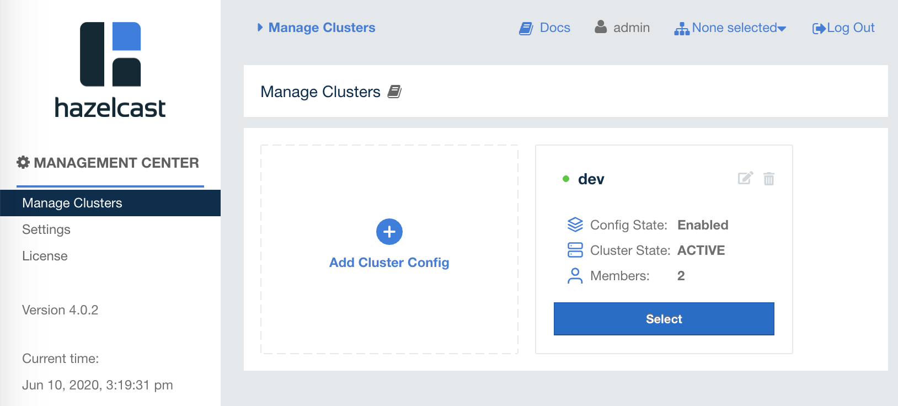

# Hazelcast with Spring Boot + JPA + Hibernate

## Prerequisites

- Docker Desktop (which includes `docker` and `docker-compose`) is installed, up and running
- JDK 1.8+ is installed


## Get Started

```sh
git clone https://github.com/brightzheng100/hazelcast-springboot-jpa-hibernate.git
cd hazelcast-springboot-jpa-hibernate

# Start the docker compose
IP_ADDR="192.168.56.1"      # CHANGE ME TO YOUR MACHINE'S IP ADDRESS, e.g. 192.168.56.1
sed "s/192.168.56.1/$IP_ADDR/g" docker-compose/docker-compose.yml > docker-compose/_docker-compose.yml
docker-compose -f docker-compose/_docker-compose.yml up
```

> Note: as per my testing, using `localhost` or `127.0.0.1` won't work properly.

> SAMPLE OUTPUT:

```
...
management-center_1  | Hazelcast Management Center successfully started at http://localhost:8080/
management-center_1  |
hazelcast1_1         | Jun 10, 2020 9:20:06 AM com.hazelcast.internal.cluster.ClusterService
hazelcast1_1         | INFO: [192.168.56.1]:5701 [dev] [4.0.1]
hazelcast1_1         |
hazelcast1_1         | Members {size:2, ver:2} [
hazelcast1_1         | 	Member [192.168.56.1]:5701 - ccd75619-d3c9-4612-a95d-0aa51dd6770b this
hazelcast1_1         | 	Member [192.168.56.1]:5702 - f2603d08-a963-479c-b9d7-8b5cb7e6d2a0
hazelcast1_1         | ]
...
```


## Setup Hazelcast

In browser, open Hazelcast's management console by navigate to: http://localhost:8090.

You then can create an account, e.g.:
- Security Provider: `Default`
- Username: `admin`
- Password: `Password1`

Then you can use this user to log into Hazelcast's management center.

In "Manage Clusters" , click "Add Cluster Config" button to add cluster, e.g.:
- Cluster Name: `dev`
- Cluster Config State: `Enabled`
- Member Addresses: e.g. `192.168.56.1:5701` `192.168.56.1:5702`



> Note: 
> 1. Again, make sure to use your machine's right IP address instead of `localhost:5701` or `127.0.0.1:5701`, otherwise the newly created cluster would be in "Disconnected" state;
> 2. Use `tab` key after keying in the the member address and you can add more member addresses.


## Try It Out

Start up the app:

```sh
./mvnw clean spring-boot:run
```

Open another console:

```sh
# Generate two employee records
# Each time you could see SQL statements printed out in app's logs
curl -s http://localhost:8080/api/v1/employee/create
curl -s http://localhost:8080/api/v1/employee/create

# List all employee records
curl -s http://localhost:8080/api/v1/employee/find/all | jq '.'

# Check the record
emp_id=$(curl -s http://localhost:8080/api/v1/employee/find/all | jq -r '.[0].empId')
curl http://localhost:8080/api/v1/employee/find/$emp_id

# However you get the record, it will always hit the cache, instead of querying the database
# If you check the Hazelcast management center -> Storage -> Maps, you could see the hits
while sleep 1; do { echo ""; curl http://localhost:8080/api/v1/employee/find/$emp_id } done
```
